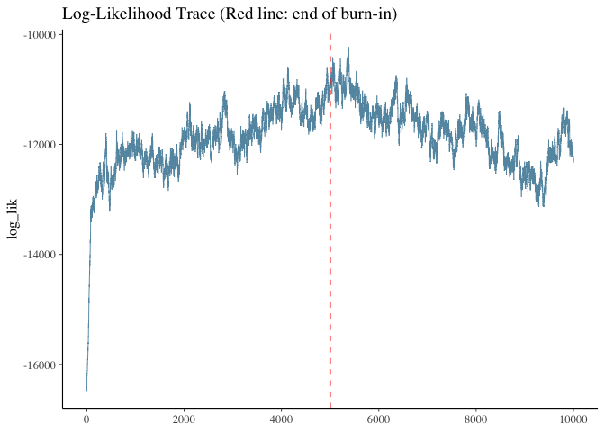
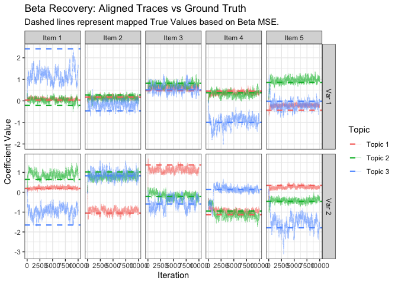
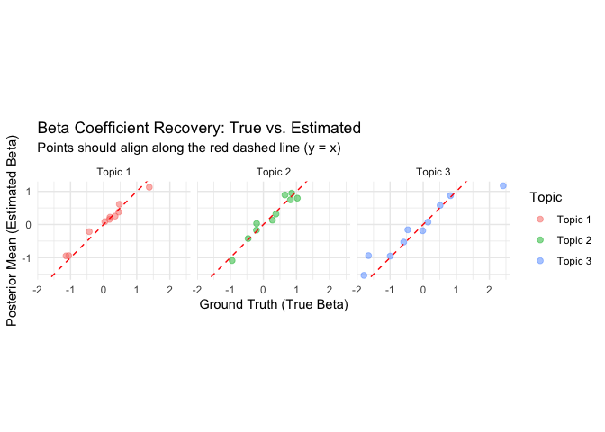
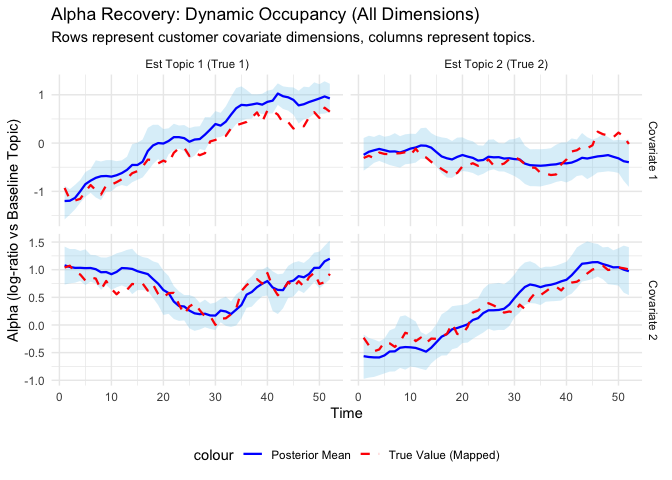

# MRDLTM: Market-Response Dynamic Linear Topic Model

<!-- badges: start -->

[](https://github.com/kyohashi/MRDLTM/actions/workflows/R-CMD-check.yaml)
<!-- badges: end -->

MRDLTM is an R package for estimating marketing response coefficients
and latent topic dynamics from ID-POS purchase data. It implements a
Market-Response Dynamic Linear Topic Model using a Gibbs sampler with
Polya-Gamma augmentation and other techniques.

## Installation

You can install the development version of MRDLTM from GitHub:

``` r
# install.packages("devtools")
devtools::install_github("kyohashi/MRDLTM")
```

## Quick Start: Synthetic Data Experiment

This example demonstrates how to generate synthetic data, run the MCMC
engine, and visualize the results.

### 1. Data Generation

We generate a synthetic dataset.

``` r
library(MRDLTM)
library(bayesplot)
library(tidyverse)
set.seed(123)

n_topic = 3
toy = generate_toy_data(
  n_cust = 100, n_item = 5, n_topic = n_topic,
  length_time = 52, n_var = 2, p_dim = 2, purchase_prob = 0.5
)

cat("Observed Purchase Rate:", mean(toy$observations$data$y), "\n")
#> Observed Purchase Rate: 0.5715769
```

### 2. Model Estimation

Initialize the model specification and run the Gibbs sampler.

``` r
# Define model
model = mrdltm_model(observations = toy$observations, n_topic = n_topic)

# Run MCMC
iter = 10000
burnin = 5000
timer = system.time({
  res = mrdltm_mcmc(model = model, iter = iter, burnin = burnin, quiet = TRUE)
})
#> Starting Gibbs Sampling: 10000 iterations (burn-in: 5000)

cat(sprintf("Total Elapsed Time: %.2f minutes\n", timer["elapsed"] / 60))
#> Total Elapsed Time: 1.47 minutes
```

Handle the label-switching issue.

``` r
# cope with the label-switching
res_fixed = reorder_mrdltm(res, burnin = burnin)
#> 
#>     ......................................................................................
#>     . Method                         Time (sec)           Status                         . 
#>     ......................................................................................
#>     . PRA                            0.02                 OK                             . 
#>     ......................................................................................
#> 
#>     Relabelling all methods according to method PRA ... done!
#>     Retrieve the 1 permutation arrays by typing:
#>         [...]$permutations$"PRA"
#>     Retrieve the 1 best clusterings: [...]$clusters
#>     Retrieve the 1 CPU times: [...]$timings
#>     Retrieve the 1 X 1 similarity matrix: [...]$similarity
#>     Label switching finished. Total time: 10.4 seconds.
```

## Diagnostics and Recovery

### log-Likelihood convergence

Check the convergence of the Log-Likelihood and the recovery of
marketing response coefficients ($\beta$).

``` r
log_lik_all = extract_samples(res, "log_lik")
mcmc_trace(log_lik_all) +
  geom_vline(xintercept = burnin, color = "red", linetype = "dashed") +
  ggtitle("Log-Likelihood Trace (Red line: end of burn-in)")
```



### Parameter Recovery (Beta)

``` r
# Use samples from res_fixed where labels are already aligned.
beta_samples = res_fixed$beta_zi # [post_iter, Z, I, M]
n_post_iter  = dim(beta_samples)[1]
n_item       = dim(beta_samples)[3]
n_var        = dim(beta_samples)[4]

# Determine Mapping between Estimated Topics and True Topics based on Beta MSE
beta_post_mean = apply(beta_samples, c(2, 3, 4), mean)
mapping = numeric(n_topic)
for (z_est in 1:n_topic) {
  mses = sapply(1:n_topic, function(z_true) {
    mean((beta_post_mean[z_est, , ] - toy$true_params$beta_zi[z_true, , ])^2)
  })
  mapping[z_est] = which.min(mses)
}
cat("Topic Mapping (Estimated -> True):", paste(1:n_topic, "->", mapping, collapse = ", "), "\n")
#> Topic Mapping (Estimated -> True): 1 -> 3, 2 -> 1, 3 -> 2

# Prepare data for Beta Grid Plot
plot_data_beta = map_dfr(1:n_var, function(v) {
  map_dfr(1:n_item, function(i) {
    map_dfr(1:n_topic, function(z) {
      data.frame(
        Iteration = 1:n_post_iter,
        Topic = paste0("Topic ", z),
        Value = beta_samples[, z, i, v],
        TrueValue = toy$true_params$beta_zi[mapping[z], i, v],
        Item = paste0("Item ", i),
        Variable = paste0("Var ", v)
      )
    })
  })
})

ggplot(plot_data_beta, aes(x = Iteration, y = Value, color = Topic)) +
  geom_line(alpha = 0.4, linewidth = 0.2) +
  geom_hline(aes(yintercept = TrueValue, color = Topic), linetype = "dashed", linewidth = 0.8) +
  facet_grid(Variable ~ Item, scales = "free_y") +
  labs(title = "Beta Recovery: Aligned Traces vs Ground Truth",
       subtitle = "Dashed lines represent mapped True Values based on Beta MSE.",
       y = "Coefficient Value") +
  theme_bw()
```



### Beta Estimation Accuracy

``` r
# Calculate posterior mean of aligned beta samples [Z, Item, Var]
beta_post_mean = apply(res_fixed$beta_zi, c(2, 3, 4), mean)
n_z = dim(beta_post_mean)[1]

# Identify the best mapping between Estimated Topics and True Topics by using MSE
mapping = numeric(n_z)
for (z_est in 1:n_z) {
  mses = sapply(1:n_z, function(z_true) {
    mean((beta_post_mean[z_est, , ] - toy$true_params$beta_zi[z_true, , ])^2)
  })
  mapping[z_est] = which.min(mses)
}

# Align True Values with Estimated Labels using the mapping
beta_true_aligned = toy$true_params$beta_zi[mapping, , ]

# Create a data frame for ggplot
accuracy_df = data.frame(
  True      = as.vector(beta_true_aligned),
  Estimated = as.vector(beta_post_mean),
  Topic     = rep(paste("Topic", 1:n_z), times = prod(dim(beta_post_mean)[-1]))
)

# Plot True vs Estimated on X-Y axes
ggplot(accuracy_df, aes(x = True, y = Estimated, color = Topic)) +
  geom_point(alpha = 0.5, size = 2) +
  geom_abline(slope = 1, intercept = 0, color = "red", linetype = "dashed") +
  coord_fixed() + # Ensure 1:1 aspect ratio
  labs(
    title = "Beta Coefficient Recovery: True vs. Estimated",
    subtitle = "Points should align along the red dashed line (y = x)",
    x = "Ground Truth (True Beta)",
    y = "Posterior Mean (Estimated Beta)"
  ) +
  theme_minimal() +
  facet_wrap(~Topic)
```



### Parameter Recovery (Alpha)

``` r
# res_fixed$alpha_zt is [post_iter, Z-1, Time, P] relative to Est Baseline (Topic Z).
n_time = dim(res_fixed$alpha_zt)[3]
n_p    = dim(res_fixed$alpha_zt)[4] # Dimension of customer covariates

# 1. Reconstruct Full True Alpha [Z, Time, P] to include the 0 baseline
true_alpha_full = array(0, dim = c(n_topic, n_time, n_p))
true_alpha_full[1:(n_topic - 1), , ] = toy$true_params$alpha_zt

# 2. Identify which True Topic acts as the Estimated Baseline
true_baseline_idx = mapping[n_topic]

# 3. Calculate Relative Alpha and Prepare Plot Data for ALL Dimensions
alpha_plot_data = map_dfr(1:n_p, function(p) { # Loop over p_dim
  map_dfr(1:(n_topic - 1), function(z_est) {
    target_true_topic = mapping[z_est]

    # Calculate true log-ratio for dimension p
    true_val_rel = true_alpha_full[target_true_topic, , p] - true_alpha_full[true_baseline_idx, , p]

    map_dfr(1:n_time, function(t) {
      sams = res_fixed$alpha_zt[, z_est, t, p] # Extract samples for dimension p
      data.frame(
        Time = t,
        Dimension = paste0("Covariate ", p),
        Topic = paste0("Est Topic ", z_est, " (True ", target_true_topic, ")"),
        Mean = mean(sams),
        Low  = quantile(sams, 0.025),
        High = quantile(sams, 0.975),
        TrueValue = true_val_rel[t]
      )
    })
  })
})

# 4. Plot with Facet Grid (Topics x Dimensions)
ggplot(alpha_plot_data, aes(x = Time, y = Mean)) +
  geom_ribbon(aes(ymin = Low, ymax = High), fill = "skyblue", alpha = 0.3) +
  geom_line(aes(color = "Posterior Mean"), linewidth = 0.8) +
  geom_line(aes(y = TrueValue, color = "True Value (Mapped)"), linetype = "dashed", linewidth = 0.8) +
  # Dimensions in rows, Topics in columns
  facet_grid(Dimension ~ Topic, scales = "free_y") +
  scale_color_manual(values = c("Posterior Mean" = "blue", "True Value (Mapped)" = "red")) +
  labs(title = "Alpha Recovery: Dynamic Occupancy (All Dimensions)",
       subtitle = "Rows represent customer covariate dimensions, columns represent topics.",
       y = "Alpha (log-ratio vs Baseline Topic)") +
  theme_minimal() +
  theme(legend.position = "bottom")
```


