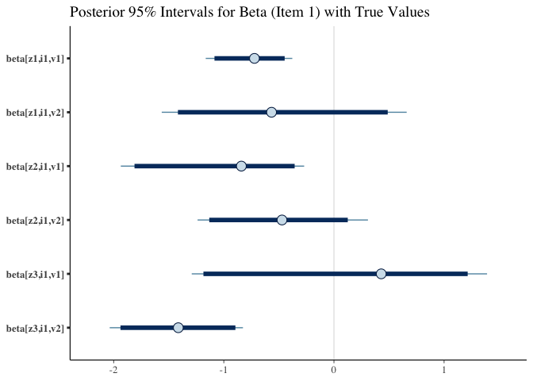

# MRDLTM: Market-Response Dynamic Linear Topic Model

<!-- badges: start -->

[](https://github.com/kyohashi/MRDLTM/actions/workflows/R-CMD-check.yaml)
<!-- badges: end -->

MRDLTM is an R package for estimating marketing response coefficients
and latent topic dynamics from ID-POS purchase data. It implements a
Market-Response Dynamic Linear Topic Model using a Gibbs sampler with
Polya-Gamma augmentation and other techniques.

## Installation

You can install the development version of MRDLTM from GitHub:

``` r
# install.packages("devtools")
devtools::install_github("kyohashi/MRDLTM")
```

## Quick Start: Synthetic Data Experiment

This example demonstrates how to generate synthetic data, run the MCMC
engine, and visualize the results.

### 1. Data Generation

We generate a synthetic dataset with 30 customers, 5 items, and 3 latent
topics across 24 time points.

``` r
library(MRDLTM)
library(bayesplot)
library(ggplot2)

set.seed(42)

# Generate synthetic observations and true parameters
toy = generate_toy_data(
  n_cust = 30, 
  n_item = 5, 
  n_topic = 3,
  length_time = 24, 
  n_var = 2, 
  p_dim = 1
)
```

### 2. Model Estimation

Initialize the model specification and run the Gibbs sampler.

``` r
# Define model
model = mrdltm_model(observations = toy$observations, n_topic = 3)

# Run MCMC
iter = 1000
burnin = 500
timer = system.time({
  res = mrdltm_mcmc(model = model, iter = iter, burnin = burnin)
})
#> Starting Gibbs Sampling: 1000 iterations (burn-in: 500)
#> Iteration 100 / 1000 (Burn-in)
#> Iteration 200 / 1000 (Burn-in)
#> Iteration 300 / 1000 (Burn-in)
#> Iteration 400 / 1000 (Burn-in)
#> Iteration 500 / 1000 (Burn-in)
#> Iteration 600 / 1000 (Sampling)
#> Iteration 700 / 1000 (Sampling)
#> Iteration 800 / 1000 (Sampling)
#> Iteration 900 / 1000 (Sampling)
#> Iteration 1000 / 1000 (Sampling)

cat(sprintf("Total Elapsed Time: %.2f minutes\n", timer["elapsed"] / 60))
#> Total Elapsed Time: 0.63 minutes
```

### 3. Diagnostics and Recovery

Check the convergence of the Log-Likelihood and the recovery of
marketing response coefficients ($\beta$).

``` r
# Extract all log likelihood samples to check convergence
log_lik_all = extract_samples(res, "log_lik", burnin = 0)
mcmc_trace(log_lik_all) +
  geom_vline(xintercept = burnin, color = "red", linetype = "dashed") +
  ggtitle("Log-Likelihood Trace")
```


``` r
# Parameter Recovery and Label Switching Diagnostics

# 1. Extract post-burnin samples
beta_post <- extract_samples(res, "beta", burnin = 0)
post_means <- colMeans(beta_post[, 1, ])

# 2. Identify the best mapping between Estimated Topics and True Topics
# This logic finds which True Topic best matches each Estimated Topic (MSE based)
n_z <- model$n_topic
mapping <- sapply(1:n_z, function(z_est) {
  mses <- sapply(1:n_z, function(z_true) {
    # Extract estimated values for this topic
    est_vals <- post_means[grep(sprintf("beta[z%d,", z_est), names(post_means), fixed = TRUE)]
    # Extract corresponding true values from toy object
    true_vals <- as.vector(toy$true_params$beta_zi[z_true, , ])
    mean((est_vals - true_vals)^2)
  })
  which.min(mses)
})

# 3. Align True Values to the Estimated Parameter Labels
# Create a named vector of true values for bayesplot functions
true_beta_vec <- sapply(names(post_means), function(name) {
  # Parse indices: z (topic), i (item), v (variable)
  idx <- as.numeric(unlist(regmatches(name, gregexpr("[0-9]+", name))))
  # Map estimated topic index to true topic index
  toy$true_params$beta_zi[mapping[idx[1]], idx[2], idx[3]]
})

# 4. Plot Trace Plots with True Values (Red Dashed Lines)
# This confirms if the chains converged to the correct ground truth
mcmc_trace(beta_post, pars = vars(contains("i1"))) +
  geom_hline(data = data.frame(
               parameter = names(true_beta_vec[grepl("i1", names(true_beta_vec))]),
               true_val = true_beta_vec[grepl("i1", names(true_beta_vec))]
             ),
             aes(yintercept = true_val), color = "red", linetype = "dashed") +
  ggtitle("Trace Plots for Beta (Item 1) with True Values")
```


``` r

# 5. Plot Posterior Intervals with True Values (Red Points)
# Using 'true' argument to automatically overlay ground truth
mcmc_intervals(beta_post, pars = vars(contains("i1")), prob = 0.95) +
  ggtitle("Posterior 95% Intervals for Beta (Item 1) with True Values")
```


