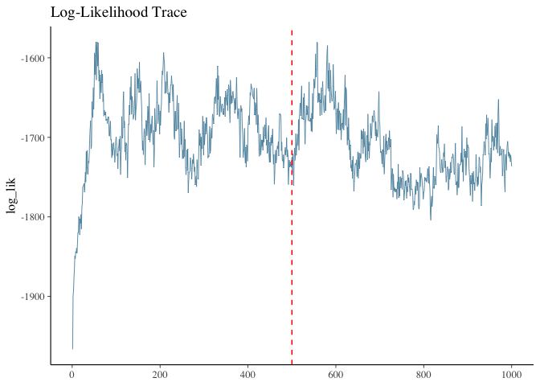

# MRDLTM: Market-Response Dynamic Linear Topic Model

<!-- badges: start -->

[](https://github.com/kyohashi/MRDLTM/actions/workflows/R-CMD-check.yaml)
<!-- badges: end -->

MRDLTM is an R package for estimating marketing response coefficients
and latent topic dynamics from ID-POS purchase data. It implements a
Market-Response Dynamic Linear Topic Model using a Gibbs sampler with
Polya-Gamma augmentation and other techniques.

## Installation

You can install the development version of MRDLTM from GitHub:

``` r
# install.packages("devtools")
devtools::install_github("kyohashi/MRDLTM")
```

## Quick Start: Synthetic Data Experiment

This example demonstrates how to generate synthetic data, run the MCMC
engine, and visualize the results.

### 1. Data Generation

We generate a synthetic dataset with 30 customers, 5 items, and 3 latent
topics across 24 time points.

``` r
library(MRDLTM)
library(bayesplot)
library(ggplot2)

set.seed(42)

# Generate synthetic observations and true parameters
toy = generate_toy_data(
  n_cust = 100, 
  n_item = 5, 
  n_topic = 2,
  length_time = 52, 
  n_var = 2, 
  p_dim = 1
)
```

### 2. Model Estimation

Initialize the model specification and run the Gibbs sampler.

``` r
# Define model
model = mrdltm_model(observations = toy$observations, n_topic = 2)

# Run MCMC
iter = 5000
burnin = 3000
timer = system.time({
  res = mrdltm_mcmc(model = model, iter = iter, burnin = burnin, quiet = TRUE)
})
#> Starting Gibbs Sampling: 5000 iterations (burn-in: 3000)

cat(sprintf("Total Elapsed Time: %.2f minutes\n", timer["elapsed"] / 60))
#> Total Elapsed Time: 0.53 minutes
```

### 3. Diagnostics and Recovery

Check the convergence of the Log-Likelihood and the recovery of
marketing response coefficients ($\beta$).

``` r
# Extract all log likelihood samples to check convergence
log_lik_all = extract_samples(res, "log_lik", burnin = 0)
mcmc_trace(log_lik_all) +
  geom_vline(xintercept = burnin, color = "red", linetype = "dashed") +
  ggtitle("Log-Likelihood Trace")
```



``` r
# --- Parameter Recovery Visualization (Beta) ---
library(tidyverse)

# 1. Extract post-burnin samples [Iteration, Topic, Item, Variable]
beta_samples = res$beta[(burnin + 1):iter, , , ]
d = dim(beta_samples)

# 2. Process Posterior Traces and Ground Truth
plot_data = map_dfr(1:d[4], function(v) {
  map_dfr(1:d[3], function(i) {
    # Prepare sorted traces
    traces_raw = as.data.frame(t(apply(beta_samples[, , i, v], 1, sort)))
    topic_names = colnames(traces_raw) # V1, V2...
    
    traces = traces_raw |>
      mutate(Iteration = row_number(), 
             Item_Idx = paste("Item", i), 
             Var_Idx = paste("Var", v)) |>
      pivot_longer(cols = all_of(topic_names), names_to = "Topic", values_to = "Value")
    
    # Prepare ground truth
    truths = data.frame(
      Topic = topic_names, 
      TrueValue = sort(toy$true_params$beta_zi[, i, v]),
      Item_Idx = paste("Item", i), 
      Var_Idx = paste("Var", v)
    )
    
    left_join(traces, truths, by = c("Topic", "Item_Idx", "Var_Idx"))
  })
})

# 3. Grid Visualization
ggplot(plot_data, aes(x = Iteration, y = Value, color = Topic)) +
  geom_line(alpha = 0.5, linewidth = 0.2) +
  geom_hline(aes(yintercept = TrueValue, color = Topic), linetype = "dashed", alpha = 0.8) +
  facet_grid(Var_Idx ~ Item_Idx, scales = "free_y") +
  labs(title = "MR-DLTM: Beta Parameter Recovery",
       subtitle = "Solid lines: Sorted MCMC traces | Dashed lines: Ground truth",
       x = "Iteration (Post-Burnin)", y = "Coefficient Value") +
  theme_minimal() +
  theme(legend.position = "none", strip.background = element_rect(fill = "gray95"))
```


